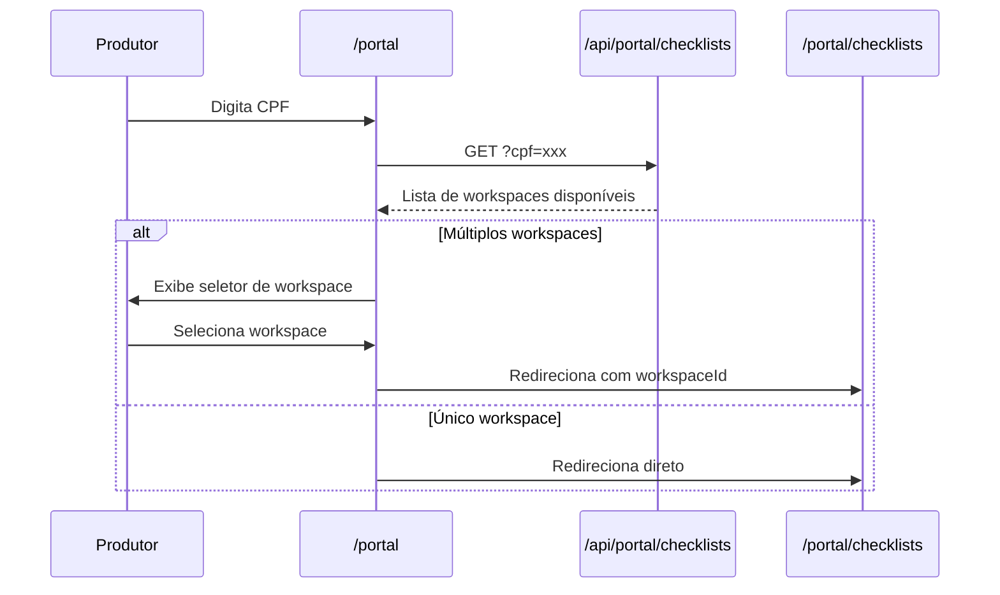

# Documentação Técnica: MerX Platform

> **Versão:** 5.1  
> **Última atualização:** 06 Fevereiro 2026  
> **Documentação completa:** [docs/](./docs/)

Este documento descreve a implementação técnica do MerX Platform, incluindo multi-tenancy, autenticação, hierarquia de checklists e internacionalização.

> **Nota:** Para documentação completa do projeto, consulte a pasta [docs/](./docs/):
> - [ARCHITECTURE.md](./docs/ARCHITECTURE.md) - Arquitetura técnica
> - [DATABASE.md](./docs/DATABASE.md) - Modelo de dados
> - [BUSINESS_FLOWS.md](./docs/BUSINESS_FLOWS.md) - Fluxos de negócio
> - [API.md](./docs/API.md) - Endpoints da API
> - [INTEGRATIONS.md](./docs/INTEGRATIONS.md) - Integrações externas

---

## 1. Multi-tenancy (Workspaces)

### 1.1 Conceito
O sistema suporta múltiplas organizações (workspaces) isoladas. Cada workspace possui seus próprios produtores, templates, checklists e usuários.

### 1.2 Modelo de Dados

```prisma
model Workspace {
  id        String   @id @default(cuid())
  name      String
  slug      String   @unique
  logoUrl   String?  @map("logo_url")
  cnpj      String?  // CNPJ para subworkspaces
  createdAt DateTime @default(now()) @map("created_at")
  updatedAt DateTime @updatedAt @map("updated_at")

  // Hierarquia de Subworkspaces
  parentWorkspaceId  String?    @map("parent_workspace_id")
  parentWorkspace    Workspace? @relation("WorkspaceHierarchy", fields: [parentWorkspaceId], references: [id])
  subworkspaces      Workspace[] @relation("WorkspaceHierarchy")
  hasSubworkspaces   Boolean    @default(false) @map("has_subworkspaces")

  users      User[]
  producers  Producer[]
  templates  Template[]
  checklists Checklist[]
  auditLogs  AuditLog[]
  aiPrompts  AiPrompt[]

  @@index([parentWorkspaceId])
  @@map("workspaces")
}
```

### 1.3 Segregação de Dados
Todas as entidades principais possuem `workspaceId`:
- `Producer.workspaceId` - Obrigatório
- `Template.workspaceId` - Obrigatório
- `Checklist.workspaceId` - Obrigatório
- `User.workspaceId` - Opcional (null = global/SuperAdmin)
- `AuditLog.workspaceId` - Opcional
- `AiPrompt.workspaceId` - Opcional (prompts globais ou por workspace)

### 1.4 Filtro Automático
O helper `getWorkspaceFilter()` em `lib/workspace-context.ts` aplica filtros automaticamente:

```typescript
// SuperAdmin vê tudo
if (session.user.role === "SUPERADMIN") return {};

// Outros usuários veem apenas seu workspace
return { workspaceId: session.user.workspaceId };
```

### 1.5 Validação de Documentos por IA

O sistema suporta validação automática de documentos enviados por produtores usando Google Gemini.

#### Campos do Workspace:
```prisma
model Workspace {
  // ... outros campos ...
  
  // Validação de Documentos por IA
  aiDocValidationEnabled         Boolean  @default(false) @map("ai_doc_validation_enabled")
  aiDocValidationEnabledForSubs  Boolean  @default(false) @map("ai_doc_validation_enabled_for_subs")
  aiDocValidationMode            String   @default("warn") @map("ai_doc_validation_mode") // "warn" | "block"
}
```

#### Hierarquia de Configuração:
1. **SuperAdmin** habilita/desabilita a feature por workspace (`aiDocValidationEnabled`)
2. **SuperAdmin** pode habilitar herança para subworkspaces (`aiDocValidationEnabledForSubs`)
3. **Admin** do workspace escolhe o modo de comportamento (`aiDocValidationMode`): `warn` (apenas avisa) ou `block` (impede envio)

#### UI de Configuração:
- **SuperAdmin** (Workspaces page): Modal `AiDocValidationConfigModal` com toggles e seletor de modo
- **Admin** (Subworkspaces page): Componentes `AiValidationSection` (workspace pai) e `SubworkspaceAiConfig` (por subworkspace)
- Permissões respeitadas: Admin só altera `aiDocValidationMode`, SuperAdmin altera tudo

#### APIs:
```
GET  /api/workspaces/[id]/doc-validation-config  - Obtém configuração (SUPERADMIN/ADMIN)
PUT  /api/workspaces/[id]/doc-validation-config  - Atualiza configuração
GET  /api/workspaces/doc-validation-status       - Status efetivo para workspace atual
POST /api/ai/validate-document                   - Validar documento via Gemini
```

### 1.6 Subworkspaces

O sistema suporta hierarquia de workspaces com até 2 níveis (workspace pai → subworkspaces).

#### Características:
- **Ativação:** SuperAdmin ativa `hasSubworkspaces` para um workspace
- **Criação:** SuperAdmin ou Admin do workspace pai pode criar subworkspaces
- **Isolamento:** Subworkspaces não veem dados uns dos outros
- **Visibilidade:** Workspace pai vê todos os dados de seus subworkspaces
- **Propriedades:** Cada subworkspace tem nome, slug, logo e CNPJ próprios
- **Restrição:** Subworkspaces não podem ter seus próprios subworkspaces

#### APIs de Subworkspaces:
```
GET  /api/workspaces/[id]/subworkspaces       - Lista subworkspaces
POST /api/workspaces/[id]/subworkspaces       - Cria subworkspace
POST /api/workspaces/[id]/toggle-subworkspaces - Ativa/desativa funcionalidade
```

#### Funções de Filtro:
```typescript
// Retorna IDs de todos os workspaces visíveis (incluindo subworkspaces)
getVisibleWorkspaceIds(session): Promise<string[]>

// Filtro Prisma que inclui workspace + subworkspaces
getSubworkspaceFilter(session): Promise<{ workspaceId: string | { in: string[] } }>

// Verifica se workspace é subworkspace de outro
isSubworkspaceOf(workspaceId, parentId): Promise<boolean>

// Verifica acesso a workspace considerando hierarquia (async)
// Permite workspace pai acessar dados de subworkspaces
hasWorkspaceAccessWithHierarchy(session, targetWorkspaceId): Promise<boolean>

// Verifica acesso simples (sync, sem hierarquia)
hasWorkspaceAccess(session, workspaceId): boolean
```

### 1.6 Atribuição de Templates a Subworkspaces

Templates criados no workspace pai podem ser atribuídos a subworkspaces específicos.

#### Modelo de Dados:
```prisma
model TemplateAssignment {
  id            String   @id @default(cuid())
  templateId    String   @map("template_id")
  workspaceId   String   @map("workspace_id") // O subworkspace que recebe o template
  assignedAt    DateTime @default(now()) @map("assigned_at")
  assignedById  String   @map("assigned_by_id")

  template    Template  @relation(fields: [templateId], references: [id], onDelete: Cascade)
  workspace   Workspace @relation(fields: [workspaceId], references: [id], onDelete: Cascade)
  assignedBy  User      @relation(fields: [assignedById], references: [id])

  @@unique([templateId, workspaceId])
  @@index([templateId])
  @@index([workspaceId])
  @@map("template_assignments")
}
```

#### Características:
- **Atribuição:** Feita na tela de edição do template (painel lateral)
- **Visibilidade:** Subworkspace vê templates próprios + atribuídos pelo pai
- **Permissões:** Templates atribuídos são **somente leitura** no subworkspace
- **Cópia:** Subworkspace pode duplicar template atribuído para ter versão editável própria
- **Remoção:** Remoção da atribuição não afeta checklists já criados

#### APIs:
```
GET  /api/templates/[id]/assignments  - Lista subworkspaces atribuídos e disponíveis
POST /api/templates/[id]/assignments  - Atualiza lista de atribuições
```

#### Fluxo de Listagem de Templates:
1. **Workspace pai:** Vê apenas templates próprios (e de subworkspaces se aplicável)
2. **Subworkspace:** 
   - Templates próprios (`workspaceId = meuId`) → editáveis
   - Templates atribuídos (`assignments.workspaceId = meuId`) → somente leitura

```typescript
// API retorna flag para controle de UI
{
  ...templateData,
  isAssigned: true,  // Veio de atribuição
  isReadOnly: true   // Não pode editar estrutura
}
```

### 1.7 Grid de Templates em Subworkspaces

Quando o usuário está em um subworkspace, o grid de templates exibe funcionalidades adicionais:

#### Coluna "Origem"
- **Próprio**: Template criado no subworkspace (badge verde)
- **Workspace Pai**: Template atribuído pelo workspace pai (badge violeta com ícone de prédio)

#### Filtro de Origem
- **Todas as origens**: Exibe todos os templates
- **Criados por mim**: Apenas templates do subworkspace
- **Do workspace pai**: Apenas templates atribuídos

#### Comportamento de Botões
- **Editar**: Desabilitado para templates read-only (do pai) ou em uso
- **Excluir**: Desabilitado para templates read-only ou em uso
- **Duplicar**: Sempre disponível (permite criar cópia editável)
- **Enviar Checklist**: Sempre disponível
- **Indicador 🔒**: Exibido para templates somente leitura

### 1.8 Integração ESG/CAR por Workspace

Cada workspace pode configurar sua própria integração com APIs socioambientais (ESG/CAR).

#### Campos do Workspace:
```prisma
model Workspace {
  // ... outros campos ...
  
  // Integração ESG/CAR
  carApiKey                  String?  @map("car_api_key")
  carCooperativeId           String?  @map("car_cooperative_id")
  esgApiEnabled              Boolean  @default(false) @map("esg_api_enabled")
  esgEnabledForSubworkspaces Boolean  @default(false) @map("esg_enabled_for_subworkspaces")
}
```

#### Hierarquia de Configuração:
1. **Workspace Pai**: Configura `carApiKey`, `carCooperativeId` e `esgApiEnabled`
2. **Subworkspaces**: Herdam configuração do pai quando `esgEnabledForSubworkspaces = true`
3. **Subworkspaces sem acesso**: Se pai não habilita, botões ESG ficam inativos

#### Lógica de Resolução de Credenciais:
```typescript
// Em um subworkspace
if (workspace.parentWorkspaceId) {
    const parent = workspace.parentWorkspace;
    if (parent.esgApiEnabled && parent.esgEnabledForSubworkspaces) {
        apiKey = parent.carApiKey;
        cooperativeId = parent.carCooperativeId;
    } else {
        // ESG não disponível para este subworkspace
    }
} else {
    // Workspace pai - usa próprias credenciais
    if (workspace.esgApiEnabled) {
        apiKey = workspace.carApiKey;
        cooperativeId = workspace.carCooperativeId;
    }
}
```

#### APIs de Configuração ESG:
```
GET  /api/workspaces/[id]/esg-config  - Obtém configuração ESG (SuperAdmin)
PUT  /api/workspaces/[id]/esg-config  - Atualiza configuração ESG (SuperAdmin)
GET  /api/workspaces/esg-status       - Verifica status ESG do workspace atual
```

#### Resposta do `/api/workspaces/esg-status`:
```json
{
  "esgEnabled": true,
  "reason": "ENABLED"  // ou "ESG_DISABLED", "PARENT_ESG_DISABLED", "MISSING_CREDENTIALS"
}
```

#### Restrições de País:
- **Produtores**: ESG disponível apenas para `countryCode = 'BR'` (CPF brasileiro)
- **Propriedades**: ESG disponível apenas para propriedades com código CAR válido (Brasil)

#### Interface do SuperAdmin:
- Botão "Integração Socioambiental" no card do workspace
- Modal com campos para API Key, Cooperative ID
- Toggles para habilitar ESG e permitir subworkspaces

---

## 2. Autenticação e Autorização

### 2.1 Stack de Autenticação
- **NextAuth.js v5** - Framework de autenticação
- **Credentials Provider** - Login com email/senha
- **bcryptjs** - Hash de senhas (cost factor 12)
- **JWT Strategy** - Tokens stateless

### 2.2 Modelo de Usuário

```prisma
enum UserRole {
  SUPERADMIN  // Global - gerencia workspaces
  ADMIN       // Workspace - acesso total no workspace
  SUPERVISOR  // Gerencia produtores atribuídos
  PRODUCER    // Acesso apenas às próprias informações
}

model User {
  id                 String    @id @default(cuid())
  email              String    @unique
  name               String?
  passwordHash       String    @map("password_hash")
  mustChangePassword Boolean   @default(true) @map("must_change_password")
  cpf                String?
  role               UserRole  @default(SUPERVISOR)
  workspaceId        String?   @map("workspace_id")
  
  @@unique([cpf, workspaceId]) // CPF único por workspace
}
```

### 2.3 Hierarquia de Permissões

| Role | Workspaces | Usuários | Produtores | Templates | Checklists |
|------|------------|----------|------------|-----------|------------|
| SUPERADMIN | CRUD | CRUD (todos) | CRUD (todos) | CRUD (todos) | CRUD (todos) |
| ADMIN | Ver próprio | CRUD (workspace) | CRUD (workspace) | CRUD (workspace) | CRUD (workspace) |
| SUPERVISOR | Ver próprio | - | Ver atribuídos | Ver | CRUD (atribuídos) |
| PRODUCER | Ver próprio | - | Ver próprio | - | Ver próprios |

**Notas sobre criação de usuários:**
- **SUPERADMIN**: Pode criar qualquer role em qualquer workspace (ou global)
- **ADMIN**: Pode criar ADMIN, SUPERVISOR e PRODUCER **apenas no seu workspace**
- Usuários criados por ADMIN são automaticamente vinculados ao workspace do ADMIN
- Menu "Usuários" visível para ADMIN e SUPERADMIN; "Workspaces" apenas para SUPERADMIN

### 2.4 Fluxo de Primeiro Acesso
1. Admin cria usuário com senha temporária
2. Usuário faz login → `mustChangePassword: true`
3. Middleware redireciona para `/dashboard/change-password`
4. Após alterar senha → `mustChangePassword: false`
5. Acesso liberado ao dashboard

### 2.5 Configuração NextAuth

```typescript
// lib/auth.ts
export const { handlers, signIn, signOut, auth } = NextAuth({
  adapter: PrismaAdapter(db),
  session: { strategy: "jwt" },
  providers: [
    Credentials({
      async authorize(credentials) {
        // Valida email/senha com bcrypt
        // Retorna user ou null
      }
    })
  ],
  callbacks: {
    jwt({ token, user }) {
      // Adiciona role, workspaceId, mustChangePassword ao token
    },
    session({ session, token }) {
      // Propaga dados do token para a sessão
    }
  }
});
```

### 2.6 Variáveis de Ambiente

```env
AUTH_SECRET=<string-aleatória-32-chars>
NEXTAUTH_URL=http://localhost:3000
```

---

## 3. Hierarquia de Checklists
Os checklists são organizados em uma estrutura recursiva no banco de dados através dos campos `parentId` e da relação `children`.

- **Checklist Original:** O ponto de partida da auditoria.
- **Checklist Filho (Correção/Complemento):** Gerado a partir de uma finalização parcial.
- **Checklist Neto:** Gerado a partir de um filho, permitindo ciclos infinitos de revisão.

### 3.1 Modelagem de Dados (Prisma)
Adicionamos o enum `ChecklistType` para garantir a integridade da identificação visual.

```prisma
enum ChecklistType {
  ORIGINAL
  CORRECTION
  COMPLETION
}

model Checklist {
  // ...
  type        ChecklistType   @default(ORIGINAL)
  parentId    String?
  parent      Checklist?      @relation("ChecklistHistory", fields: [parentId], references: [id])
  children    Checklist[]     @relation("ChecklistHistory")
}
```

### 3.2 Lógica de Sincronização "AS IS"
A sincronização ocorre durante o `finalize` e o `partial-finalize`. Diferente da lógica anterior (que sincronizava apenas aprovados), agora sincronizamos o estado atual completo.

### Algoritmo de Merge:
1. Identifica o `parentId`.
2. Itera sobre todas as respostas do checklist atual.
3. Filtra apenas respostas com status `APPROVED` ou `REJECTED`.
4. Executa um `upsert` no checklist pai, transportando:
   - `status` (Exato como no filho)
   - `answer` e `observation`
   - `fileUrl`, `quantity`, `validity`
   - `rejectionReason` (Fundamental para manter o histórico de falhas no pai)

### 3.3 Diferenciação de Tipos (Correção vs. Complemento)
A tipagem não é mais baseada em heurísticas de conteúdo, mas sim na intenção de criação:

- **CORRECTION:** Criado levando itens explicitamente `REJECTED`.
- **COMPLETION:** Criado levando itens `MISSING` ou que sequer possuem registro de resposta no banco (Faltantes).

### 3.4 Interface de Auditoria
A barra lateral de itens (`ChecklistManagementClient`) utiliza um sistema de códigos de cores baseado no estado da resposta:

- `bg-emerald-50`: Aprovado
- `bg-red-50`: Rejeitado
- `bg-amber-50`: Respondido (Aguardando Verificação)
- `bg-slate-100`: Não Respondido (Vazio)

### 3.5 Bloqueio de Finalização com Filhos Abertos

O sistema impede a finalização de um checklist pai se existirem checklists filhos que ainda não foram finalizados.

#### Validação Server-side:
```typescript
// app/api/checklists/[id]/finalize/route.ts
const openChildren = await db.checklist.findMany({
  where: {
    parentId: checklistId,
    status: { notIn: ['FINALIZED', 'APPROVED'] }
  }
});

if (openChildren.length > 0) {
  return NextResponse.json({
    error: 'Cannot finalize: open child checklists exist',
    openChildren: openChildren.map(c => ({ id: c.id, type: c.type, status: c.status }))
  }, { status: 400 });
}
```

#### Feedback no Frontend:
O `checklist-management-client.tsx` trata o erro 400 e exibe um alert com a lista de checklists filhos em aberto (tipo e status).

### 3.6 Segurança e Confirmação
Implementamos um guard rails no `handleFinalize` para evitar sincronizações acidentais de erros:
- Se existirem itens `REJECTED`, um `window.confirm` solicita autorização explícita do supervisor informando que esses itens serão marcados como falhas no checklist master.

### 3.6 Pré-preenchimento de Checklists

Permite criar um novo checklist carregando respostas aprovadas de um checklist anterior.

#### Regras:
- Apenas checklists finalizados (`APPROVED`, `FINALIZED`, `PARTIALLY_FINALIZED`) podem ser usados como fonte
- O checklist fonte deve ser do mesmo template
- Apenas respostas com status `APPROVED` são copiadas
- Respostas copiadas recebem status `PENDING_VERIFICATION` para nova análise

#### APIs:
```
GET /api/checklists/available-for-prefill?templateId=xxx
    - Retorna lista de checklists finalizados do mesmo template
    - Ordena por data de finalização (mais recente primeiro)
    - Limite de 20 resultados

POST /api/checklists
    - Novo parâmetro: prefillFromChecklistId (opcional)
    - Se fornecido, copia respostas aprovadas para o novo checklist
```

#### Fluxo UI:
1. Usuário abre modal de enviar checklist
2. Seleciona template e produtor
3. Marca checkbox "Pré-preencher com checklist anterior"
4. Seleciona checklist da lista (mostra produtor, data, nº de itens)
5. Ao criar, respostas são copiadas automaticamente

### 3.7 Hierarquia Recursiva no Grid

O grid de checklists suporta até 4 níveis de profundidade:
- **Nível 0:** Checklist original (pai)
- **Nível 1:** Correção/Complemento (filho)
- **Nível 2:** Neto
- **Nível 3:** Bisneto
- **Nível 4:** Tataraneto

Cada nível tem indentação progressiva e pode ser expandido/recolhido individualmente.

## 4. Internacionalização de Produtores

### 7.1 Modelo de Dados
Adicionamos suporte a produtores internacionais através de novos modelos:

```prisma
model ProducerIdentifier {
  id         String   @id @default(cuid())
  producerId String
  category   String   // personal | fiscal
  idType     String   // cpf, dni, ssn, cnpj, cuit, ein
  idValue    String
  createdAt  DateTime @default(now())
  
  @@unique([producerId, category])
  @@map("producer_identifiers")
}

model AgriculturalRegistry {
  id            String   @id @default(cuid())
  producerId    String   @unique
  registryType  String   // car, renspa, fsa
  registryValue String
  countryCode   String
  
  @@map("agricultural_registries")
}
```

### 7.2 Configuração por País
O arquivo `lib/countries.ts` centraliza as regras de cada país:

```typescript
export const COUNTRIES: Record<string, CountryConfig> = {
  BR: {
    personalDoc: { type: 'cpf', validation: 'cpf', required: true },
    fiscalDoc: { type: 'cnpj', validation: 'cnpj', required: false },
    agriculturalRegistry: { type: 'car', useIntegration: true },
    propertySource: 'car',
    requiresEsg: true
  },
  AR: {
    personalDoc: { type: 'dni', validation: 'numeric', required: true },
    fiscalDoc: { type: 'cuit', validation: 'alphanumeric', required: false },
    agriculturalRegistry: { type: 'renspa', useIntegration: false },
    propertySource: 'manual',
    requiresEsg: false
  }
};
```

### 7.3 Hierarquia de Propriedades
O campo `type` em `PropertyField` distingue:

- **`property`**: Polígono da fazenda/propriedade (renderizado com contorno branco)
- **`field`**: Talhão dentro da propriedade (renderizado em amarelo)

### 7.4 Fluxo de Cadastro por País

| País | Identificação | Propriedade | ESG |
|------|---------------|-------------|-----|
| BR | CPF + CNPJ (opcional) | CAR automático | Sim |
| AR | DNI + CUIT (opcional) | Upload/Desenho | Não |
| US | SSN + EIN (opcional) | Upload/Desenho | Não |

### 7.5 Componentes Especializados

- **`CountrySelector`**: Dropdown de seleção de país com bandeiras
- **`GeoFileUpload`**: Upload de KML/GeoJSON com parsing e cálculo de área
- **`PropertyMapInput`**: Comportamento dinâmico baseado em `countryCode`

---

## 8. Visibilidade de Dados para Workspace Pai

### 8.1 Conceito
Workspaces pai podem visualizar dados dos subworkspaces em modo somente leitura. A interface apresenta abas separadas para distinguir dados próprios e dados de subworkspaces.

### 8.2 Abas de Produtores

```typescript
// Página: app/[locale]/dashboard/produtores/page.tsx
// Aba "Meus Produtores": GET /api/producers?scope=own
// Aba "Subworkspaces": GET /api/producers?scope=subworkspaces
```

- **Meus Produtores**: Grid editável com todas as ações (editar, enviar checklist, reanalisar ESG)
- **Subworkspaces**: Grid somente leitura com coluna "Workspace" e filtro por subworkspace

### 8.3 Abas de Checklists

```typescript
// Página: app/[locale]/dashboard/checklists/page.tsx
// Aba "Meus Checklists": GET /api/checklists?scope=own
// Aba "Subworkspaces": GET /api/checklists?scope=subworkspaces
```

- **Meus Checklists**: Grid com todas as ações (gerenciar, copiar link, WhatsApp)
- **Subworkspaces**: Grid somente leitura, apenas visualização

### 8.4 Parâmetro `scope` nas APIs

```typescript
// Em /api/producers/route.ts e /api/checklists/route.ts
const scope = searchParams.get("scope"); // 'own' | 'subworkspaces' | null

if (scope === 'own') {
    where.workspaceId = session.user.workspaceId;
} else if (scope === 'subworkspaces') {
    const subworkspaceIds = parentWorkspace.subworkspaces.map(sw => sw.id);
    where.workspaceId = { in: subworkspaceIds };
}
```

### 8.5 Condição de Exibição
As abas só são exibidas se:
1. Usuário está em um workspace pai (`parentWorkspaceId === null`)
2. O workspace tem subworkspaces habilitados (`hasSubworkspaces === true`)

---

## 9. Portal do Produtor Multi-workspace

### 9.1 Conceito
Produtores podem pertencer a múltiplos workspaces/subworkspaces (mesmo CPF). O portal permite selecionar e alternar entre workspaces.

### 9.2 Fluxo de Login



### 9.3 API do Portal

```typescript
// GET /api/portal/checklists?cpf=xxx&workspaceId=yyy
{
    producer: { name: "...", cpf: "..." },
    checklists: [...],
    availableWorkspaces: [
        { id: "...", name: "...", logoUrl: "...", isSubworkspace: false },
        { id: "...", name: "...", logoUrl: "...", isSubworkspace: true }
    ],
    selectedWorkspace: { ... },
    hasMultipleWorkspaces: true
}
```

### 9.4 Alternador de Workspace
No dashboard do portal, um dropdown no cabeçalho permite alternar entre workspaces:

```typescript
// Salvo em localStorage
localStorage.setItem('merx_portal_workspace', workspaceId);
// Refaz a busca com novo workspace
await fetchData(cpf, workspaceId);
```

---

## 10. Armazenamento de Arquivos (AWS S3)

### 10.1 Conceito
O sistema utiliza AWS S3 (bucket `pocs-merxlabs`) para armazenamento de documentos e fotos enviados por produtores. A estrutura do bucket é compartilhada entre projetos, com segregação por prefixo.

### 10.2 Estrutura do Path
```
checklist/{workspaceId}/{subworkspaceId|_root}/{checklistId}/{itemId}/{fieldId}/{timestamp}_{filename}
```

- `_root` é usado quando o workspace não possui subworkspace (é raiz)
- `timestamp` é o epoch em milissegundos para evitar colisões de nome

### 10.3 Utilitário S3 (`lib/s3.ts`)

```typescript
// Funções disponíveis
export const s3Client: S3Client;
export function buildS3Key(params): string;
export async function uploadToS3(key, buffer, contentType): Promise<void>;
export async function getPresignedUrl(key, expiresIn?): Promise<string>;
export async function getPresignedUploadUrl(key, contentType, expiresIn?): Promise<string>;
export async function deleteFromS3(key): Promise<void>;
```

### 10.4 APIs de Upload

```
POST /api/upload                    - Upload via multipart/form-data
GET  /api/upload/presigned-url?s3Key=xxx  - Gerar URL temporária de leitura
```

### 10.5 Visualização pelo Supervisor

O componente `DocumentViewerModal` permite visualizar documentos inline:
- **Imagens:** Exibição com controles de zoom (25% - 300%)
- **PDFs:** Embedding via iframe
- **Resolução automática:** S3 keys são convertidas em presigned URLs transparentemente
- **Portal rendering:** Modal renderizado via `createPortal(document.body)` para evitar problemas de stacking context
- **Nome limpo:** Timestamp e caminho S3 removidos do nome exibido (regex `^\d+_`)
- **Attachments (requestArtifact):** Para itens não-FILE com `requestArtifact=true`, documentos anexados são visíveis via `renderAttachment()` em `checklist-item-detail.tsx`

### 10.5.1 requestArtifact

O campo `requestArtifact` em um item de template indica que o item solicita um documento/foto anexo:
- **Visão do produtor** (`ChecklistItem.tsx`): Upload aparece sempre que `requestArtifact=true`, independente da resposta
- **Visão do supervisor** (`audit-action-panel.tsx`): Upload disponível para preenchimento interno
- **Tipos suportados:** `single_choice`, `multiple_choice`, `dropdown_select` e todos os demais
- **Tipos aceitos para upload:** JPEG, PNG, GIF, WebP, PDF, DOC, DOCX, XLS, XLSX

### 10.6 Validação de Documentos por IA

Fluxo de validação no upload do produtor:

```
┌──────────────┐     ┌──────────────┐     ┌──────────────┐
│  Produtor    │────▶│  Upload S3   │────▶│  Gemini AI   │
│  faz upload  │     │  /api/upload │     │  /api/ai/    │
│              │     │              │     │  validate-   │
└──────────────┘     └──────────────┘     │  document    │
                                          └──────┬───────┘
                                                 │
                              ┌───────────────────┤
                              │                   │
                              ▼                   ▼
                    ┌──────────────┐     ┌──────────────┐
                    │  Mode: WARN  │     │ Mode: BLOCK  │
                    │  Banner de   │     │ Impede envio │
                    │  aviso       │     │ do checklist │
                    └──────────────┘     └──────────────┘
```

### 10.7 Variáveis de Ambiente S3

```env
S3_BUCKET=pocs-merxlabs
S3_REGION=us-east-1
S3_ACCESS_KEY=<access-key>
S3_SECRET_KEY=<secret-key>
# S3_ENDPOINT=  # Opcional, para S3-compatible storage
```
